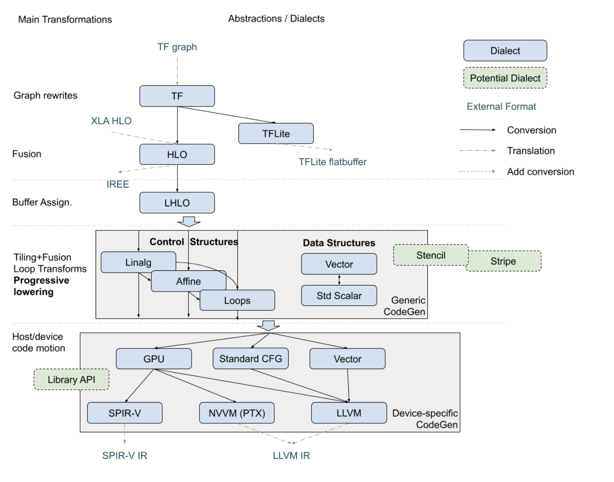

# 👻 IREE

## 1. IREE 简介

> 官方网站：https://openxla.github.io/iree/
>
> mlir类比cpp，dialect类比stl，iree类比一个完整的项目

[IREE](https://github.com/google/iree#iree-intermediate-representation-execution-environment) (Intermediate Representation Execution Environment)是一种基于MLIR的端到端编译器，可以将ML模型lower到统一的IR。具有它自己的高级表示以及一组 dialects，从代码生成的目的来说，**这些 dialects 正在向 Linalg-on-tensors 的方向发展**，严重依赖于tensor层级上的fusion。IREE-specific dialects 主要用于组织计算有效载荷，目前可以表示为MHLO、TOSA、Linalg-on-tensors等。

> 在tensor级别fusion通常更简单，因为不需要跟踪对buffer的读取和写入

讲解下图： https://drive.google.com/drive/u/0/folders/1sRAsgsd8Bvpm_IxREmZf2agsGU2KvrK-

主要特征：

- 提前编译调度和执行逻辑
- 支持dynamic shapes, flow control, streaming和其他高级模型功能
- 针对许多 CPU 和 GPU 架构进行了优化
- 低开销、流水线执行以实现高效的功率和资源使用
- 嵌入式系统上的二进制文件大小低至 30KB
- 调试和分析支持

## 2. IREE 结构

IREE对ML模型编译采用整体方法(holistic approach)：生成的IR既包含==调度逻辑==，又包括==执行逻辑==。

> 调度逻辑：需要将数据依赖性传达给低级并行流水线硬件/API (low-level parallel pipelined hardware/API)（如 [Vulkan](https://www.khronos.org/vulkan/)）。
>
> 执行逻辑：将硬件上的密集计算编码为特定于硬件/API 的二进制文件，如[SPIR-V](https://www.khronos.org/spir/)。

a) **导入您的模型**

[使用受支持的框架](https://iree-org.github.io/iree/getting-started/#supported-frameworks)之一开发程序，然后使用 IREE 的导入工具之一运行模型。

b) **选择您的[硬件部署配置](https://iree-org.github.io/iree/deployment-configurations/)**

确定目标平台、加速器和其他限制。

c) **编译你的模型**

通过 IREE 编译，根据您的部署配置选择编译目标。

d) **运行你的模型**

使用 IREE 的运行时组件来执行编译后的模型。

## 3. IREE Compiler

- **IREE Compiler (LLVM Target)**

大多数转换都发生在 Linalg Dialect 中，在 tensor 或者 buffer 级别，以及 bufferization 过程(tensor向buffer转换)。执行文件的首选路径是**lower到 Vector Dialect**，在这里可以进行额外的转换。当从 Linalg Dialect 往下 lowering 时，SCF 可用于围绕向量操作的控制流(control flow around vector operations)，但对这些操作不执行任何转换。去生成 SCF Dialect 本质上意味着不再进行进一步的结构优化。Vector Dialect 可以逐步 lower 到复杂度较低的抽象，直到最终生成 LLVM Dialect。

- **IREE Compiler (SPIR-V Target)**

[SPIR-V](https://mlir.llvm.org/docs/Dialects/SPIR-V/)(Standard Portable Intermediate Representation, [Khronos group](https://www.khronos.org/spir/) standard.)是IREE编译器的主要目标。顶层流程类似于生成 LLVM IR 的流程，**大多数转换都发生在 Linalg-on-tensor 和 Vector 级别上**。从这里开始，lowering 倾向于直接转到 SPIR-V ，SPIR-V 具有一组跨越多个抽象级别的丰富操作集，操作集中包含：高级操作、结构化控制流和类指令的原语(high-level operations, structured control flow and instruction-like primitives)。该流程通过 GPU Dialect 进行 device-only operations，如工作项标识符提取，并依赖 IREE 的 runtime 来管理 GPU 内核。

> SPIR-V 最初发布于 2015 年。SPIR-V 是多个 Khronos API 共用的中间语言，包括 Vulkan, OpenGL, 以及 OpenCL。
>
> Khronos Group 的标语是“连接软件与硬件”，简明扼要地总结了它的任务。这种连接是通过标准规范 (standard) 和编程接口。**Khronos Group 定义标准规范以及编程接口；硬件厂商提供它们的硬件实现，软件厂商则可以让软件在所有支持的平台与设备上运行。**Khronos Group 定义维护了很多标准规范，比较著名的有 Vulkan, OpenGL, 以及 OpenCL。
>
> SPIR-V 支持通过多种机制来扩展其功能，包括添加新的枚举值，引入新的扩展 (extension)，或者通过某个命名空间引入一整套指令 (extended instruction set)。其扩展也分为不同等级——厂商自有扩展 (vendor specific)、多厂商联合支持的扩展 (EXT)、 以及 Khronos 级别的扩展 (KHR)。

最近的一些工作实现了 允许 IREE 从 Vector Dialect 转换到 GPU Dialect，将 GPU 线程暴露为向量通道(在warp或block级别)。类似地，有些工作中实现了 绕过中间阶段，直接从 Linalg 和 Vector 转换到 SPIR-V，但可能会被渐近式的 lowering 方法取代。

## 4. IREE opt

> 在https://github.com/iree-org/iree/commit/823fe5ace7285e5fda555ef12dbb029a130e73ef中提到
>
> "iree-hlo-to-linalg-on-tensors" 改成了 "iree-codegen-hlo-to-linalg-on-tensors",

iree-opt -h | grep hlo
       --iree-codegen-flow-hlo-to-hlo-preprocessing             -   Apply hlo to hlo transformations for some hlo ops
       --iree-codegen-hlo-to-linalg-on-buffers                  -   Convert from XLA-HLO ops to Linalg ops on buffers
       --iree-codegen-hlo-to-linalg-on-tensors                  -   Convert from XLA-HLO ops to Linalg ops on tensors
       --iree-codegen-shape-convert-hlo                         -   Converts dynamic shape dependent HLO ops to shaped variants.
      --lhlo-legalize-to-linalg                        -   Legalize from LHLO dialect to Linalg dialect
      --hlo-legalize-to-linalg                         -   Legalize from HLO dialect to Linalg dialect

编译参考：https://openxla.github.io/iree/building-from-source/getting-started/#prerequisites

编译好的iree-opt在`iree-build/tools`

## 5. IREE 发展路线

待翻译：

https://github.com/openxla/iree/blob/main/docs/developers/design_roadmap.md

